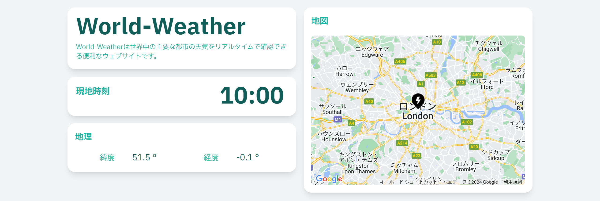
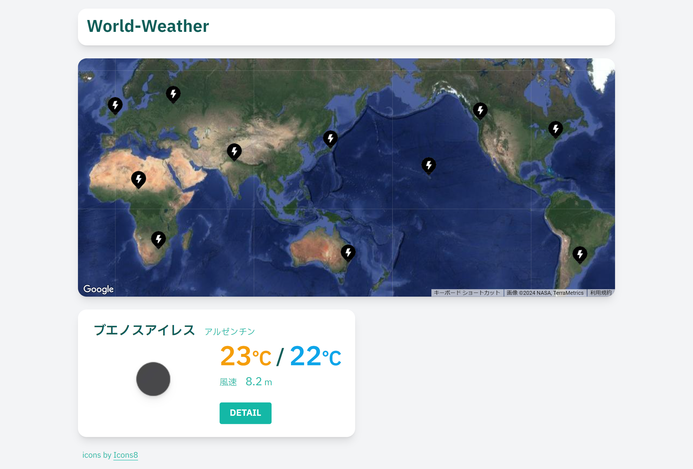
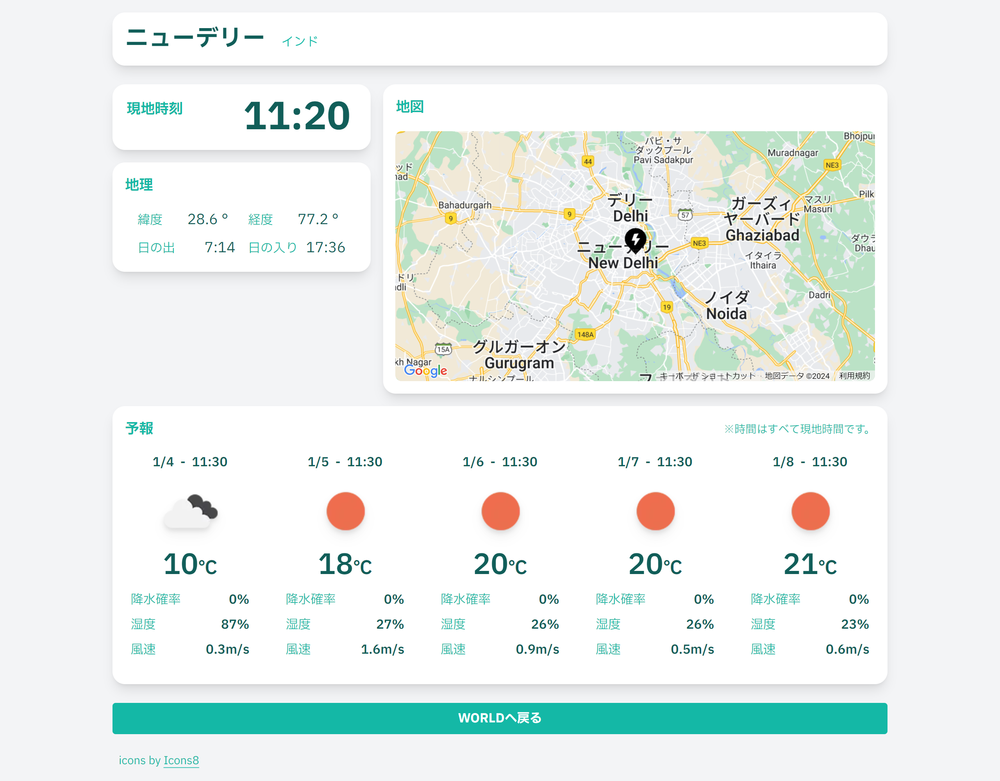

## URL

どなたでも登録なしでご利用できます

[World-Weather](https://world-weather-zeta.vercel.app/world)

## 概要

「World-Weather」は、世界中の都市の天気情報をリアルタイムで確認できる便利なウェブサイトです。 
Next.js、OpenWeatherAPI、そして Google Maps API を活用し、シンプルで使いやすいデザインに仕上げ、ユーザーが簡単かつ迅速に必要な気象情報を取得できるようにしました。

## 開発への想いや動機

このサイトの開発においては、ユーザーが簡単かつ迅速に目的の情報を得られることを最優先に考えました。旅行やビジネスにおいて天気情報が与える影響を考慮し、ユーザーがどこにいても、どんなデバイスを使っても快適に利用できるようなサービスを目指しました。 
現在は特定の都市のみですが、ユーザーの任意の都市の気象情報を取得できるように、機能の実現を目指しています。

## 画面と機能

| <h4 style="text-align:center;">都市選択</h4> | <h4 style="text-align:center;">都市詳細</h4> |
|---|---|
|  |  |
| 地図上のアイコンをクリックすると、その都市の現在の天気と気温を見ることが出来ます。DETAIL から詳細画面へ遷移します。 | 現地時刻や詳細地図、1 ～ 5 日後の天気予報まで見ることが出来ます。 |

## 使用技術

#### フロントエンド

- Next.js
   
  JavaScript,Prettier を用いてコーディングしています。デザインは TailWindCSS を使用。

#### API

- OpenWeather
   
  天気情報を取得する API として採用しました。
- Google Maps JavaScript
   
  地図を取得する API として採用しました。 React で使うライブラリとして@googlemaps/react-wrapper を使っています。地図の中央位置、ズーム倍率の初期設定、ピンを画像に変更など

#### サーバー

- Vercel
   
  デプロイはすべて Vercel 上で行っています。github にプッシュすれば自動でデプロイされ、Vercel のサーバーにて公開されます。
