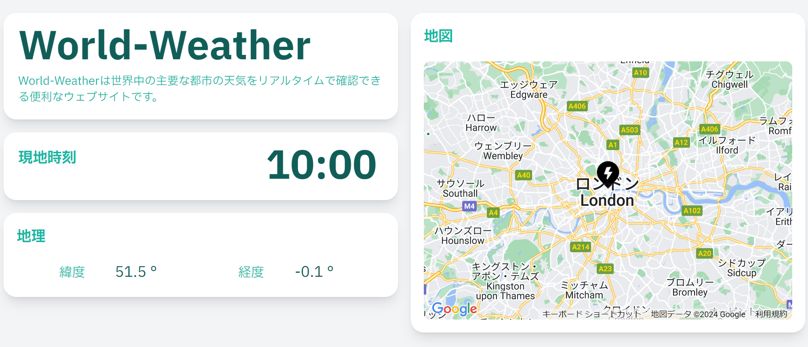
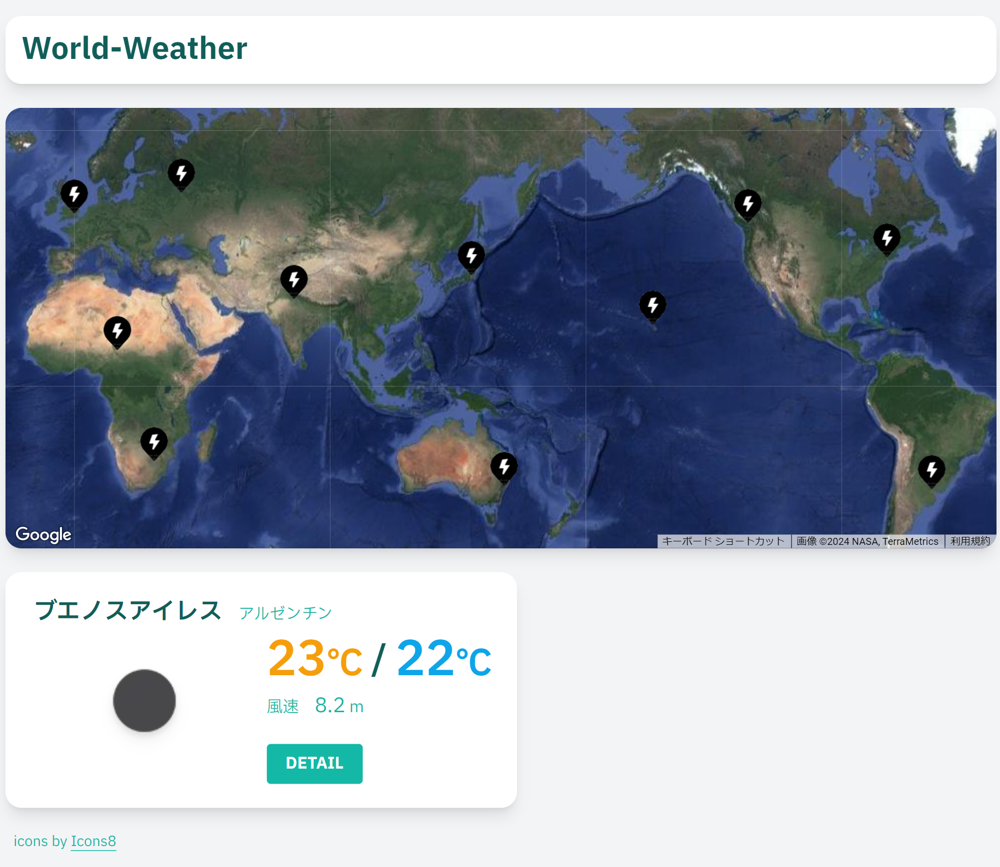
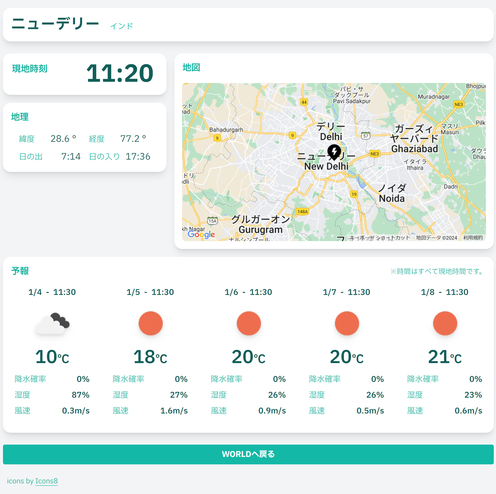

## :sun_with_face:URL

どなたでも登録なしでご利用できます 
[World-Weather](https://world-weather-zeta.vercel.app/world)

## :crescent_moon:概要

「World-Weather」は、世界中の都市の気象情報をリアルタイムで確認できる便利なウェブサイトです。 
Next.js、OpenWeatherAPI、GoogleMapsAPI を活用し、シンプルで使いやすいデザインに仕上げ、ユーザーが様々なデバイスで必要な気象情報を取得できるようにしました。

## :sun_behind_rain_cloud:開発への想いや動機

私は友人との旅行に行った際、予想外の雨で旅行の計画が台無しになったり、その度にモヤモヤとした気分に襲われることがありました。この経験から、気軽に世界中の都市の天気を確認できるサービスがあれば、旅行計画がもっとスムーズになるのではないかと考え、開発を始めました。 
開発においては、ユーザーが簡単かつ迅速に目的の情報を得られることを最優先に考えました。旅行やビジネスにおいて気象情報が与える影響を考慮し、ユーザーがどこにいても、どんなデバイスを使っても快適に利用できるようなサービスを目指しました。現在は特定の都市のみですが、ユーザーの任意の都市の気象情報を取得できるように、機能の実現を目指しています。 
世界中どこでも位置情報を取得し、気象情報が出るように機能を追加しました。 (2024.02.13)

## :snowflake:画面と機能

| <h3 style="text-align:center;">都市選択</h3>                                                                              | <h3 style="text-align:center;">都市詳細</h3>                   |
| ------------------------------------------------------------------------------------------------------------------------- | -------------------------------------------------------------- |
|                                                                                          |                                |
| 地図上のアイコンまたは任意の位置をクリックすると、現在の天気と気温を見ることが出来ます。DETAIL から詳細画面へ遷移します。 | 現地時刻や詳細地図、1~5 日後の天気予報まで見ることが出来ます。 |

## :rainbow:使用技術

### フロントエンド

- Next.js 14.0.3
- JavaScript
- TailWindCSS 3.3.6
- Prettier
- ESLint

### API

- OpenWeather 
  気象情報を取得する API として採用しています。 
  都市選択画面では緯度と経度を正しく送ることによって、地図上すべての点で天気と都市名を見ることが出来ます。また都市詳細画面では都市名から天気予報を取得しており、それぞれ別のエンドポイントから呼び出しています。 
  Next.js の API Routes を経由することによって、セキュリティを強化しています。

- Google Maps JavaScript
   
  地図を取得する API として採用しています。Next.js 上で使う為、ライブラリとして@googlemaps/react-wrapper を使用しています。地図の中央位置、ズーム倍率などの初期設定、ピンを画像に変更など、見やすく分かりやすいデザインにするためにカスタムしています。 
  また地図上の任意の点から座標を取り出すのにも使用しています。

### サーバー

- Vercel
   
  デプロイはすべて Vercel 上で行っています。github にプッシュすれば自動でデプロイされ、Vercel のサーバーにて公開されます。
